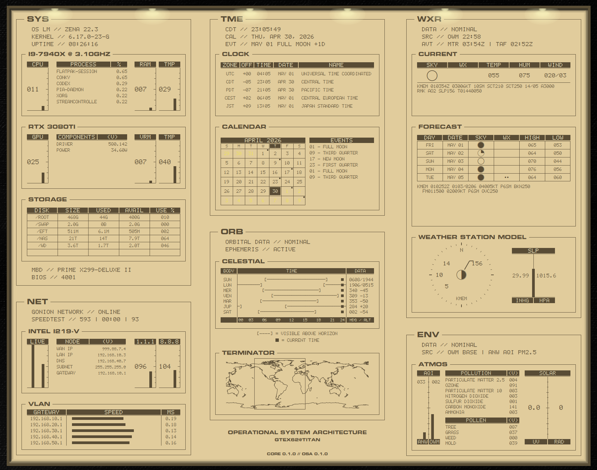

# gtex62-osa

`gtex62-osa` is the first native suite built for the shared
[`gtex62-core`](../gtex62-core/README.md) engine model.

OSA is a single Conky tactical chassis with six coordinated panels: system,
time/calendar, weather, network, orbital/terminator, and environmental data.
The suite owns the visual language and panel composition. The engine owns the
runtime model, provider orchestration, normalized cache, and shared setup.

## Table of Contents

- [Purpose](#purpose)
- [Screenshots / Design References](#screenshots--design-references)
- [Features](#features)
- [Requirements](#requirements)
- [Installation](#installation)
- [Quick Start](#quick-start)
- [Configuration](#configuration)
- [Runtime Model](#runtime-model)
- [Repository Layout](#repository-layout)
- [Panel Map](#panel-map)
- [Customization](#customization)
  - [Scale](#scale)
  - [Column positions](#column-positions)
  - [Palette](#palette)
- [Troubleshooting](#troubleshooting)
- [Engine-Suite Template Notes](#engine-suite-template-notes)
- [License](#license)

## Purpose

The older gtex62 suites are self-contained: each suite carries its own config
examples, cache helpers, fonts, icons, provider scripts, and diagnostics. OSA
uses the newer engine split:

- `gtex62-core` owns shared runtime behavior and machine-specific setup.
- `gtex62-shared-assets` owns reusable fonts, wallpapers, icons, and shared
  data assets.
- `gtex62-osa` owns only OSA-specific layout, drawing, suite view models,
  documentation, and Conky entrypoints.

General architecture, provider contracts, cache roots, and bootstrap behavior
are documented in [`gtex62-core`](../gtex62-core/README.md). This README keeps
the suite-level facts close at hand without copying the engine manual.

## Screenshots / Design References



*`lcd_parchment` palette with frame lights enabled.*

## Features

- Single transparent Conky chassis with an OSA tactical panel grid.
- SYS panel with CPU, RAM, temperature, GPU, VRAM, storage, process, and
  conditional health status.
- TME panel with local/world clocks, monthly calendar, event markers, and a
  conditional event/cache status line.
- WXR panel with current weather, forecast, METAR/TAF-derived station model,
  and provider status.
- NET panel with WAN/LAN status, VLAN host meters, ping, pfSense status, and
  cached speedtest summary.
- ORB panel with celestial position rows and an Earth terminator view backed by
  shared coastline data.
- ENV panel with air quality, solar/pollen/environmental rows, and provider
  health summaries.
- Engine-driven cache model using shared provider outputs under
  `~/.cache/gtex62-core/`.

## Requirements

Base runtime:

- Conky with Lua + Cairo support, for example `conky-all`
- `bash`, `jq`, `curl`
- `lua` or Lua support through Conky
- `lm-sensors` for CPU temperature where available
- `feh` if you want the launcher to apply shared wallpapers

Fonts:

- `gtex62-wx-symbols.ttf` and `gtex62osa.ttf` from `gtex62-shared-assets`
  are **required** for OSA to render correctly. Install them with the core font
  helper (see [Installation](#installation)) or copy them manually into
  `~/.local/share/fonts/` and run `fc-cache -f`.

Optional data sources:

- OpenWeather API key for weather and forecast.
- AirNow API key for AQI.
- Aviation station identifiers for METAR/TAF output.
- SSH target for pfSense-backed network data.
- Ookla `speedtest` CLI when manually refreshing speedtest snapshots.
- `nvidia-smi` for NVIDIA GPU identity, utilization, temperature, and driver
  status.

Shared repositories expected next to this suite:

```text
~/.config/conky/
├── gtex62-core/
├── gtex62-osa/
└── gtex62-shared-assets/
```

## Installation

Install system packages. Debian / Ubuntu / Mint example:

```bash
sudo apt update
sudo apt install -y conky-all jq curl lua5.4 lm-sensors feh
sudo sensors-detect || true
```

Clone the engine, shared assets, and suite into the Conky config root:

```bash
mkdir -p ~/.config/conky
cd ~/.config/conky
git clone https://github.com/GTex62/gtex62-core.git
git clone https://github.com/GTex62/gtex62-shared-assets.git
git clone https://github.com/GTex62/gtex62-osa.git
```

Install fonts from shared assets (optional, but the two OSA-required fonts must
be present — see [Requirements](#requirements)):

```bash
bash ~/.config/conky/gtex62-core/scripts/install-fonts.sh
```

This copies all fonts from `gtex62-shared-assets/fonts/` into
`~/.local/share/fonts/` and rebuilds the font cache. Run it once after cloning.

The suite no longer carries its own `fonts/`, `assets/`, `examples/`, or
legacy config archive. Those belong to the engine and shared-assets repos.

## Quick Start

Bootstrap the runtime config:

```bash
cd ~/.config/conky/gtex62-osa
bash scripts/bootstrap-runtime-root.sh
```

Edit the main local config file:

```bash
$EDITOR ~/.config/gtex62-core/site.toml
```

Then launch OSA:

```bash
bash ~/.config/conky/gtex62-osa/scripts/start-conky.sh
```

The launcher asks for a shared wallpaper, exports the runtime paths, and then
delegates to:

```text
~/.config/conky/gtex62-core/bin/gtex62-core-launch --suite osa
```

## Configuration

Most local setup belongs in one file:

```text
~/.config/gtex62-core/site.toml
```

Use it for:

- API keys
- home latitude, longitude, and timezone
- primary network interface
- VLAN labels and hosts
- speedtest baseline/fallback tier
- aviation stations
- pfSense SSH target and interface names

Domain profile files still exist under:

```text
~/.config/gtex62-core/profiles/
```

Those profiles are for domain-specific overrides. A normal install should not
require editing a pile of suite-local files.

Runtime suite binding lives at:

```text
~/.config/gtex62-core/suites/osa.toml
```

## Runtime Model

Standard engine roots:

```text
config  ~/.config/gtex62-core/
data    ~/.local/share/gtex62-core/
cache   ~/.cache/gtex62-core/
assets  ~/.config/conky/gtex62-shared-assets/
```

Compatibility environment variables are still exported for older helpers, but
new code should prefer:

- `GTEX62_CONFIG_DIR`
- `GTEX62_CACHE_DIR`
- `GTEX62_CORE_DIR`
- `GTEX62_SHARED_ASSETS`
- `GTEX62_SUITE_ID`

See the core README and docs for provider schemas and cache contracts:

- [gtex62-core README](../gtex62-core/README.md)
- [Core Architecture](../gtex62-core/docs/architecture.md)
- [Next Generation Model](../gtex62-core/docs/next-generation-model.md)

## Repository Layout

```text
gtex62-osa/
├── suite.toml      # suite identity, entrypoints, shared asset roots
├── README.md
├── design/         # visual references and measured concept images
├── docs/           # OSA-only implementation notes and references
├── lua/
│   ├── lib/        # thin local compatibility/helper layer
│   ├── suite/      # OSA-derived view models over engine cache
│   ├── ui/         # chassis and panel drawing
│   └── widgets/    # Conky Lua entrypoint
├── scripts/        # OSA launch/wrapper helpers only
├── theme/          # layout, panels, and visual theme
└── widgets/        # Conky config entrypoints
```

Not present by design:

- `assets/`
- `fonts/`
- `examples/`
- `legacy/config/`

## Panel Map

`SYS`
: OS/kernel status, health condition slot, CPU/RAM/TMP meters, GPU/VRAM/TMP
  meters, storage rows, and process table.

`TME`
: local date/time, next event or calendar fault line, world clock table, and
  monthly calendar with event markers.

`WXR`
: weather source status, current conditions, forecast, aviation text, and
  station model.

`NET`
: interface and WAN/LAN state, speedtest snapshot, ping, VLAN host meters, and
  pfSense SSH gate status.

`ORB`
: solar/lunar/planetary rows plus terminator map using shared geo data.

`ENV`
: air quality, solar, pollen/environmental rows, and data-source fault lines.

## Customization

Start with these files:

- [theme/osa-theme.lua](theme/osa-theme.lua): colors, fonts, meter styling,
  table sizing, panel internals.
- [theme/panels.lua](theme/panels.lua): panel positions and box geometry.
- [theme/osa-layout.lua](theme/osa-layout.lua): frame dimensions, column
  positions, and suite scale.
- [widgets/osa-main.conky.conf](widgets/osa-main.conky.conf): Conky window and
  update interval.

### Scale

The entire suite — geometry, line weights, and fonts — scales from two fields
in `theme/osa-layout.lua`:

```lua
layout.scale_mode = "manual"   -- "manual" or "auto"
layout.scale      = 1.0        -- active when scale_mode = "manual"
```

In `"manual"` mode, `layout.scale` is a fixed multiplier applied to all
drawing. Values above `1.0` enlarge the suite; values below shrink it.
`0.75` and `1.25` are reasonable bounds for most monitors.

In `"auto"` mode, the scale is computed from the environment variables
`CONKY_SCREEN_W` and `CONKY_SCREEN_H` against the base frame dimensions
(`1736 × 1368`). Export both before launching Conky and the suite will fit the
screen proportionally without any manual tuning.

Restart Conky after changing `scale` or `scale_mode`.

### Column positions

Column x positions are defined in `layout.columns` in `theme/osa-layout.lua`
and are the authoritative source for panel placement. Changing a column x there
moves all panels in that column. `theme/panels.lua` owns the per-panel
y-position, height, and box geometry.

### Palette

OSA supports a simple monochrome palette selector through `CONKY_OSA_PALETTE`.
Available palettes are defined in [theme/osa-palettes.lua](theme/osa-palettes.lua);
the default is `amber`.
Generate the palette PDF with
`../gtex62-core/scripts/generate_palette_pdf.py --suite osa`.

Data customization belongs in `~/.config/gtex62-core/site.toml` unless the
change is truly suite-specific.

## Troubleshooting

Refresh the runtime examples from core:

```bash
bash scripts/bootstrap-runtime-root.sh --force
```

Refresh network cache manually:

```bash
bash scripts/refresh_net_cache.sh
```

Check provider outputs:

```bash
find ~/.cache/gtex62-core/shared -maxdepth 3 -type f | sort
```

If a panel is blank, check the matching core provider cache first. OSA panels
render derived views from engine cache; they should not need suite-local copies
of provider data.

## Engine-Suite Template Notes

Future engine-native suites should follow the same shape:

- Keep suite READMEs focused on the user-visible suite, entrypoints, panel map,
  and suite-owned customization.
- Put provider setup, cache schemas, runtime bootstrap, and cross-suite
  architecture in `gtex62-core`.
- Put fonts, reusable icons, wallpapers, and shared data assets in
  `gtex62-shared-assets`.
- Avoid suite-local `legacy/config`, `examples`, provider scripts, or duplicate
  binary asset folders.
- Prefer `site.toml` as the single first-edit config file for new users.

## License

See [LICENSE](LICENSE).
